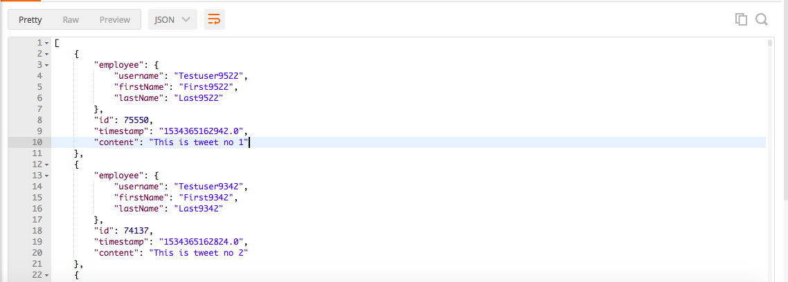
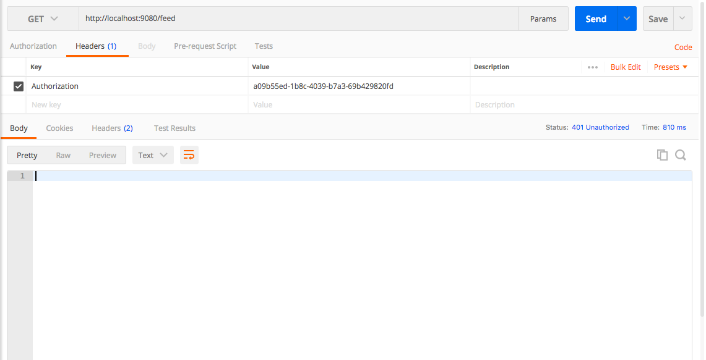

# Twitterish

This is a sample twitter like application. I have used Spring boot, Hibernate, JPA and SQLlite. 

I have created a session for Testuser2 with the following token "a09b55ed-1b8c-4039-b7a3-69b429820fd3" that should be passed in the Authorization header

Api route : http://localhost:9080/feed

Header: Authorization a09b55ed-1b8c-4039-b7a3-69b429820fd3

